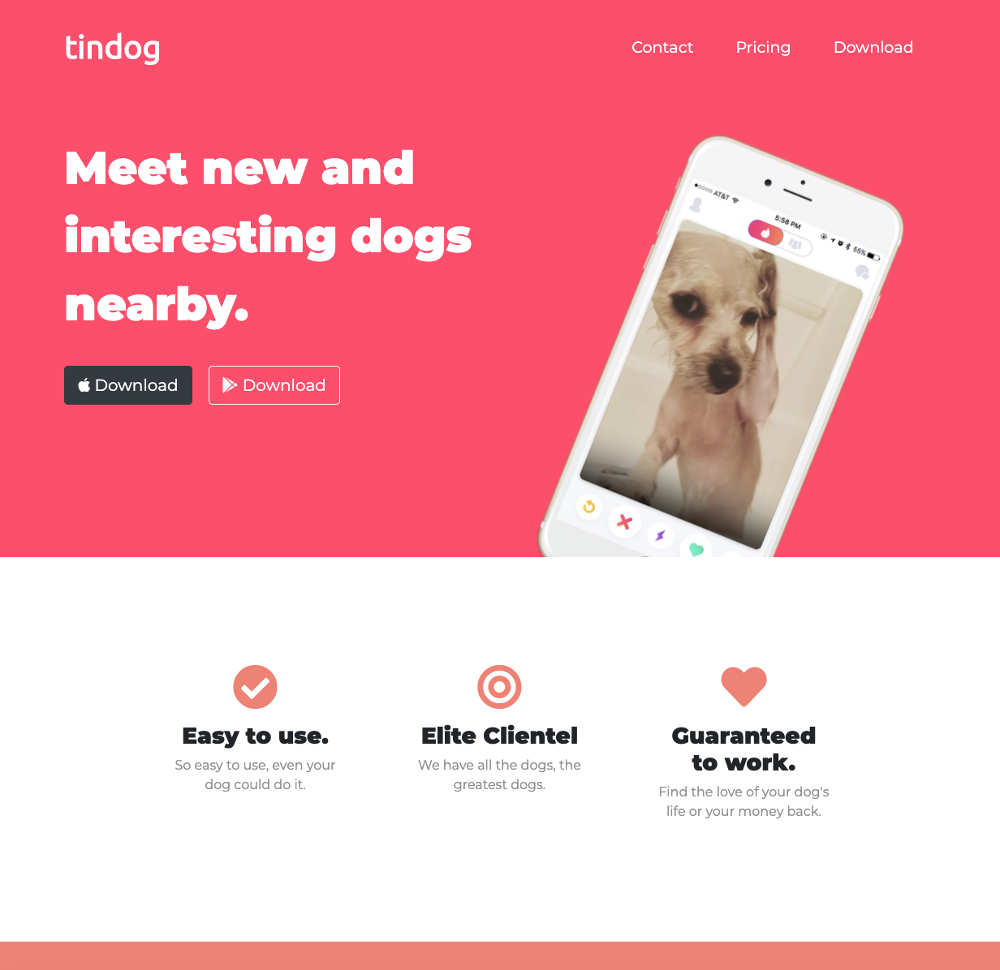

<h1>TinDog</h1>
<h2>John Manouse</h2>

I created an application using HTML & CSS to replicate a tinder app for dogs. This site doesn't currently contain any js, but may in the future.

 
<h2>TinDog Summary</h2>
<ul>
    <li>HTML code</li>
    <li>CSS</li>
</ul>

<h2>Pull Requests welcome for contribution</h2>

John Manouse

Live Link: <a href="https://mirageg4.github.io/TinDog/"
>TinDog Live Link</a>

Github: <a href="https://github.com/Mirageg4/TinDog">TinDog Repo</a>

              

License: Project is licensed under the MIT License. 
See <a href ="LICENSE.md">LICENSE</a> file for details.
